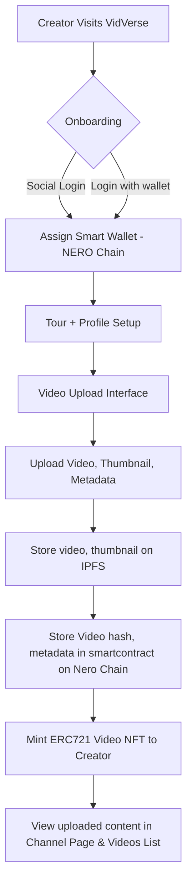
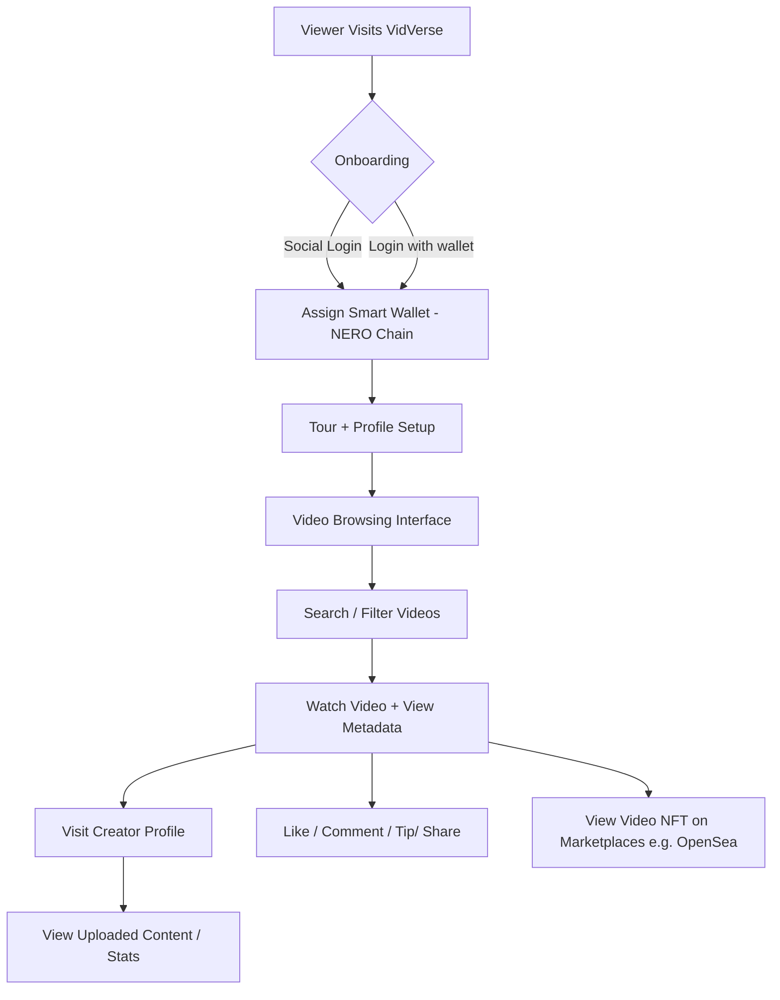

# VidVerse - Decentralized Video Sharing Platform

## Overview

VidVerse is a decentralized, ad-free video sharing platform empowering content creators and making Web3 accessible to everyone. Leveraging NERO Chain’s Paymaster and Account Abstraction (AA), VidVerse delivers a gasless, frictionless, and Web2-like experience with powerful creator monetization and videos stored on decentralized storage (IPFS).

## Vision

Today’s creator platforms are controlled by centralized entities that decide who gets reach, how they get paid, and how creators interact with their audience. This leads to a lack of transparency, unfair monetization practices, and a disconnect between creators and their audience. VidVerse aims to change that by providing a decentralized platform that puts creators in control of their content and their audience.

- **Decentralization**: VidVerse is built around the Blockchain and IPFS, which means that no single entity controls the platform. Media content will be stored on IPFS, ensuring that it is censorship-resistant and accessible to everyone. This ensures that creators have full ownership of their content and can interact with their audience without intermediaries.

- **Tokenized Content**: VidVerse will allow creators to tokenize their content, enabling them to license their videos as NFTs and wider access to content on NFT marketplaces. This gives creators more control over their content and allows them to monetize it in new ways.

- **Easy onboarding & Gasless interactions**: VidVerse uses Nero Chain's Account Abstraction (AA) and Paymaster to enable easy onboarding through secure social logins, programmable authorizations, and gasless interactions. Creators and viewers can interact with the platform without worrying about gas fees or complex wallet setups. This makes it easier for creators to engage with their audience and for viewers to access content.

- **Content Moderation**: VidVerse will use a decentralized moderation system that allows the community to vote on content. This ensures that the platform remains free from harmful or inappropriate content while giving creators the freedom to express themselves. Also, moderation system is planned to ensure video social dynamics(likes, comments, etc.) are not manipulated by bots or malicious actors.

- **Ad-free**: VidVerse is ad-free. No ads, no tracking, and no data collection. Enjoy a clean and private viewing experience. This also means that creators can monetize their content in a fairer way, without relying on ad revenue.

- **Direct Creator Support**: Viewers can tip creators, ensuring that creators receive the full amount without any intermediaries.

- **Familiar user experience**: VidVerse is designed to be familiar to users of traditional video sharing platforms like YouTube. This means that creators can easily transition to VidVerse without having to learn a new platform, and viewers can easily find and interact with content.

By using NERO Chain's Native Account Abstraction(AA), Paymaster features, VidVerse onboards the next billion users to Web3 with a truly frictionless experience, allowing them to interact with the platform without worrying about gas fees or complex wallet setups. This makes it easier for creators and viewers to engage with the platform and helps to drive adoption of decentralized technologies.

## Core Features

- **Decentralized Storage**: All videos are stored on IPFS, ensuring censorship resistance and permanence

- **Tokenized Content**: Creators can tokenize their videos as NFTs, allowing them to license their content and access wider audiences through NFT marketplaces.

- **Gasless Interactions**: Users can upload, tip, like, and comment without paying gas, thanks to Nero Chain’s paymaster and account abstraction.

- **Social Logins**: Users can log in using their social media accounts, making it easy to onboard new users.

- **Direct Creator Support**: Viewers can tip creators directly, ensuring that creators receive the full amount without any intermediaries.

- **Creator channels**: Each creator has a personalized profile page showcasing uploaded content, tip stats, and social interactions.

- **Video social dynamics**: Users can like, comment, and share videos, creating a social experience around video content.

- **Decentralized moderation**: The community can vote on content moderation, ensuring that the platform remains free from harmful or inappropriate content.

## Architecture

### How it works

#### 1. User Onboarding

- Users visits VidVerse and are prompted to log in using their social accounts(Google, GitHub etc.) or connect their crypto wallets.
- Once logged in, users are assigned a smart wallet on the NERO chain, which is powered by Nero Chain Account Abstraction Platform.
- A tour is provided to help users understand the platform's features and functionalities.
- Users can complete their profile and start uploading videos.

#### 2. Video Uploading

- Users can upload videos through a simple interface, which allows them to upload video, thumbnail, and to add titles, descriptions, category and tags, etc..
- The video and thumbnail are uploaded to IPFS, and the metadata is stored in smartcontract on the NERO chain.
- The video is tokenized as an ERC721 NFT (with rich onchain metadata of video) which is minted to the creator's wallet.

#### 3. Browsing Videos, Tipping, and Interacting(Likes, Comments)

- Users can browse videos through a simple interface, which allows them to search, filter by category, and sort videos by various criteria(e.g., most recent, most popular, etc.).
- Upon clicking on a video, users can view the video, its metadata, and interact with it by liking, commenting, and tipping the creator.
- Users can also share videos on social media platforms to increase visibility and engagement.
- Users can also view the creator's profile page, which showcases their uploaded content, tip stats, and social interactions(likes, comments, etc.).
- Viewers can also see Video NFT on various marketplaces(e.g., OpenSea) from video page

#### Creator Experience Flow

#### Viewer Experience Flow

### Technology Stack

- **Frontend**: React.js, Next.js, Antdesign
- **Web3Client**: Wagmi, ethers.js
- **Storage**: IPFS, Pinata
- **Smart contracts**: Solidity, Openzeppelin, Hardhat
- **Data Indexing**: Goldsky's Mirror, TheGraph(Once Nero chain is supported)
- **Blockchain**: NERO Chain (EVM compatible)
- **Smartwallets/AA & Paymaster**: NERO Chain's AA UserOp SDK and Paymaster APIs

## Roadmap

### Phase 1: MVP (2 Months)

- Core smartcontracts for video upload, edit, tokenization (ERC721), and user channels(profiles).
- Social logins and smartwallets integration
- Basic Paymaster and Account abstraction platform integration.
- Subgraph implementation for video metadata and user interactions.
- Basic UI for video upload, viewing, search, filtering.

### Phase 2: Advanced Features (3 Months)

- Video social dynamics (likes, comments, tips) implementation.
- Integrate live streaming capabilities using services like Push, Livepeer, or Huddle01.
- Community voting & Content moderation system integration.
- Enhanced user engagement features, notiifications, analytics for creators and viewers.
- Advanced searching, recommendation, and filtering features.
- Enhanced UI/UX for creators and viewers.
- Integration of analytics dashboard for real-time insights.

## References

- [Introduction - Nero Chain](https://docs.nerochain.io/en/getting-started/introduction)
- [Key Features - Nero Chain](https://docs.nerochain.io/en/getting-started/key-features)
- [Dapp Architecture - Nero Chain](https://docs.nerochain.io/en/getting-started/nero-dapp-architecture)
- [Native Account Abstraction - Nero Chain](https://docs.nerochain.io/en/core-concepts/native-account-abstraction/nativeAccountAbstractionSupport)

## Safety & Security

This is an experimental software and subject to change over time.

This is a proof of concept and is not ready for production use. It is not audited and has not been tested for security. Use at your own risk. I do not give any warranties and will not be liable for any loss incurred through any use of this codebase.

# License

This project is licensed under the MIT License - see the [LICENSE](LICENSE) file for details.
